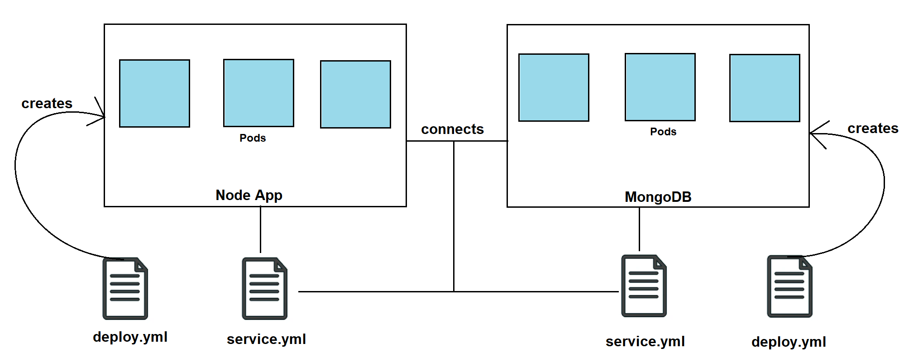

# Running Apps using Kubernetes



## Setup
- Make sure Kubernetes is enabled on Docker's settings. This process could take a while to enable.
- `kubectl` will give commands available and check if install was correctly done, and default clusters can be seen in the Docker app
- `kubectl get service` or `svc` will show the running services with info
- `kubectl get` with `name_of_resource`, `node` or `pods` to view some information
- Can use `kubectl describe pod_id` to see what is inside a pod, which are similar to containers
- Can use Docker desktop to view more container details and see what is running

## The Task
- Create a deployment file called `nginx_deployment.yml`
- `kubectl create -f file_name.yml` will run the deployment file
- `kubectl get deployment` or `deploy` will list what has been deployed and what is running
- `kubectl get pods` will now display each replica
- To launch the deployment to public browsers, we need to create `nginx_service.yml` to connect with the deployment
- Run this service file with same `create` command, and nginx server is now available on localhost
- `kubectl edit deploy nginx-deployment` opens notepad to live edit (vi editor) the deployment file, which has been added to by k8
- `kubectl delete pod pod_id` will delete pods, k8 will redeploy pods with self healing - i.e. if there are 3 and one is deleted/goes down, k8 will load balance while recreating it
- `kubectl edit svc nginx-deployment` will open editing for the service 
- load balancer, cluster ip or node ports can be used for services
- `kubectl delete deploy nginx-deployment` and `kubectl delete svc nginx-deployment` are used to get rid of a service and its pods

## In a Nutshell
- `kubectl create -f mongo-deployment.yml`
- `kubectl create -f nginx_k8_deploy.yml`
- `kubectl delete deploy node`

## What Is a Cron Job?
cron is a Linux utility that schedules a command or script on your server to run automatically at a specified time and date. A cron job is the scheduled task itself. Cron jobs can be very useful to automate repetitive tasks.

For example, you can set a cron job to delete temporary files every week to conserve your disk space. Some programs, such as Drupal, may require you to set up a cron job to perform certain functions.

Scripts executed as a cron job are typically used to modify files or databases. However, they can perform other tasks that do not modify data on the server, like sending out email notifications.

## Horizontal Pod Autoscaler
The Horizontal Pod Autoscaler automatically scales the number of Pods in a replication controller, deployment, replica set or stateful set based on observed CPU utilization (or, with custom metrics support, on some other application-provided metrics). Note that Horizontal Pod Autoscaling does not apply to objects that can't be scaled, for example, DaemonSets.

The Horizontal Pod Autoscaler is implemented as a Kubernetes API resource and a controller. The resource determines the behavior of the controller. The controller periodically adjusts the number of replicas in a replication controller or deployment to match the observed metrics such as average CPU utilisation, average memory utilisation or any other custom metric to the target specified by the user.

For more information check out the official documentation at https://kubernetes.io/docs/tasks/run-application/horizontal-pod-autoscale/

## K8 Task - PHP Frontend with Mongo

- The guestbook application has a web frontend serving the HTTP requests written in PHP. It is configured to connect to the mongo Service to store Guestbook entries.
- First we must deploy the mongodb (deployment and service).
- After we deploy the Guestbook frontend (deployment and service).

### Steps for completing the task

```bash
kubectl get all  # See all things running
kubectl delete [svc or deploy or anything else] [name of thing]  # Repeat until empty
kubectl create -f mongo-deployment.yml
kubectl create -f mongo-service.yml
kubectl create -f frontend-deployment.yml
kubectl create -f frontend-service.yml
# Wait a few mins
```

## K8 Task - Cronjob

- It is used to schedule commands at a specific time. These scheduled commands or tasks are known as "Cron Jobs".

### Use Cases

- Send data to API: We can create a CronJob resource that sends data to an API or a database every fifteen minutes for example
- Account management: If you have a membership site, where accounts have expiration dates, you can schedule cron jobs to regularly deactivate or delete accounts that are past their expiration dates.
- You can send out daily newsletter e-mails.
- You can expire and erase cached data files in a certain interval.
- You can auto-check your website content for broken links and have a report e-mailed to yourself regularly.

### Steps for completing the task

```bash
# Cron schedule syntax
# ┌────────────────── timezone (optional)
# | ┌───────────── minute (0 - 59)
# | │ ┌───────────── hour (0 - 23)
# | │ │ ┌───────────── day of the month (1 - 31)
# | │ │ │ ┌───────────── month (1 - 12)
# | │ │ │ │ ┌───────────── day of the week (0 - 6) (Sunday to Saturday;
# | │ │ │ │ │ 7 is also Sunday on some systems)
# | │ │ │ │ │
# | │ │ │ │ │
# CRON_TZ=UTC *

# Create yml job file
kubectl apply -f cron-job.yml
kubectl get cronjob
kubectl get job --watch
# copy name from job and paste it on command bellow
pods=$(kubectl get pods --selector=job-name=eng89-27163575 --output=jsonpath={.items[*].metadata.name})
kubectl logs $pods
```

## K8 Task - Kompose Covert

- Kompose is a conversion tool for Docker Compose to container orchestrators such as Kubernetes.

### Why Use it?

- Simplify your development process with Docker Compose and then deploy your containers to a production cluster
- Convert your docker-compose.yaml with one simple command kompose convert

### Example Usage

```bash
# Install kompose using chocolatey
choco install kubernetes-kompose
# Go to the same directory as your docker-compose file
kompose convert
```
